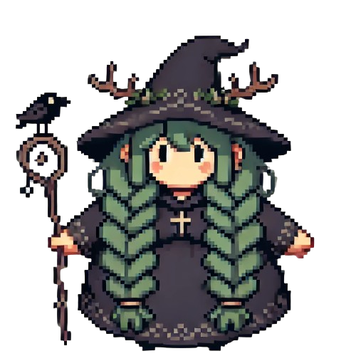
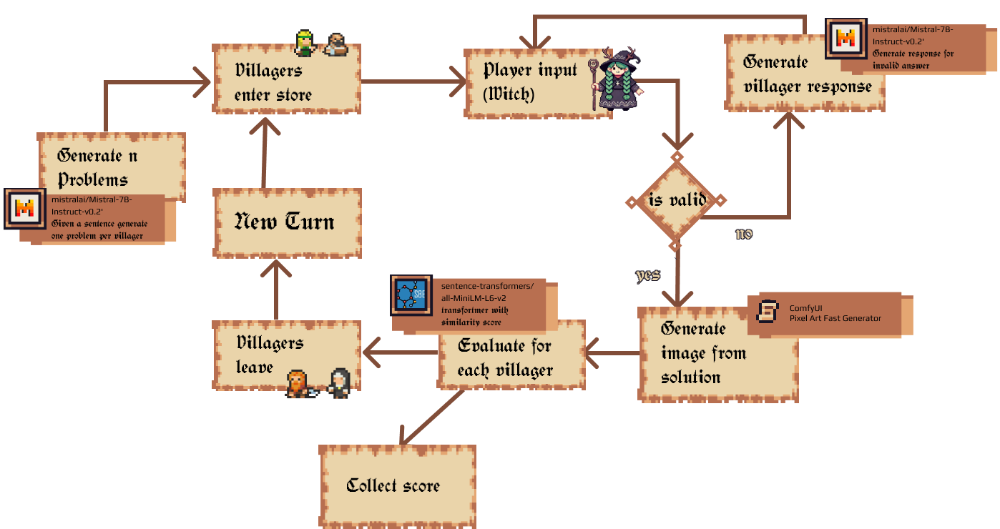

# One Spell Fits All

In the land of AI and Games conferences 4 brave adventurers set out to create a game.

You are a witch who struggles with her magic, you can create anything but for a limited amount of time. How can you please all these villagers who come to you with their problems?

We use a variety of generative tools to create both the problems that the villagers come to you with and the responses they give you. We feed the LLM the solution to the problem and the problems are created from this one word. The solution

## Inspiration

This project is inspired by [1001 Nights](https://store.steampowered.com/app/2542850/1001_Nights/). Go wishlist it!

## Technologies and Tools

### Unity
- **Version:** 2022.3.30f1

### LLM for Unity
- **Model:** Mistral 7B Instruct
- **Repository:** [LLMUnity](https://github.com/undreamai/LLMUnity)

### ComfyUI
- **Repository:** [ComfyUI](https://github.com/comfyanonymous/ComfyUI)
- **Integration Tutorial:** [ComfyUI in Unity](https://www.youtube.com/watch?v=iJUhw5hTiVI)
- **Pixel Art Generator:** [Pixel Art Fast Generator for ComfyUI](https://openart.ai/workflows/megaaziib/pixel-art-fast-generator/XkwkHIWGhMLWxQuBIsd1)
- **RMBG for ComfyUI:** [RMBG for ComfyUI](https://github.com/ZHO-ZHO-ZHO/ComfyUI-BRIA_AI-RMBG/tree/main)

### Sprites
- [Minif Villagers](https://lyaseek.itch.io/minifvillagers)
- [Minif Villagers 2](https://lyaseek.itch.io/minifvillagers2)
- [Pixel Speech Bubbles](https://opengameart.org/content/pixel-speech-bubbles)
- [Pixel Holy Spell Effect 32x32 Pack 3](https://bdragon1727.itch.io/pixel-holy-spell-effect-32x32-pack-3)

### Transformers
- **Model:** all-MiniLM-L6-v2
- **Using:** Sentis for Unity (com.unity.sentis)
- **Tutorial:** [Create an AI Robot NPC using Hugging Face](https://thomassimonini.substack.com/p/create-an-ai-robot-npc-using-hugging?r=dq5fg&triedRedirect=true)

### Custom Sprites
- **Tool:** OpenAI's Dall-E

### Team 
- Tom Tucek
- Dipika Rajesh
- Georgia Samaritaki
- Kseniia Harshina 

Stay tuned for more updates and get ready to dive into our confusing yet exciting game soon!
